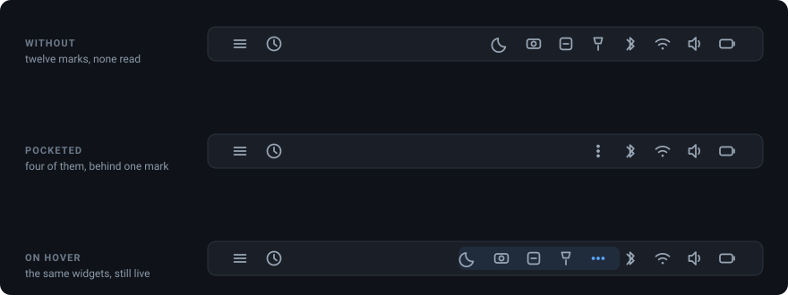
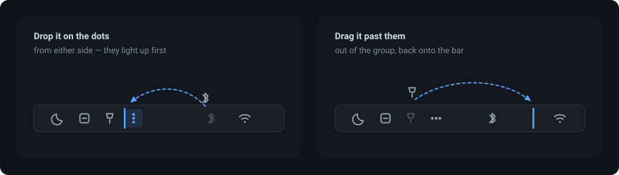

<div align="center">

# Pocket

**Tuck a run of Omarchy bar widgets behind one mark, and fan them back out on hover.**

[](https://github.com/jrmmhm/omarchy-pocket/actions/workflows/ci.yml)
[](https://omarchy.org)
[](https://github.com/basecamp/omarchy)
[](LICENSE)

</div>

<!-- Motion demo goes here once recorded: docs/pocket-demo.gif -->



A bar that has grown to a dozen widgets is a bar you stop reading. Pocket takes
the ones you rarely need, hides them behind a single mark, and brings them back
the moment you point at it. They stay fully usable while they are out — the same
widgets, not stand-ins.

## Install

```bash
omarchy plugin add https://github.com/jrmmhm/omarchy-pocket.git --enable
```

Then drag the widgets you want it to hold onto it. That is the whole setup.

## Put things in, take things out



**Drop a widget on the dots and it goes in.** From either side — the mark lights
up while a release would collect it, so you know before you let go. The bar draws
its own insertion line at the same time, and the two always agree.

**Drag a member past the dots and it comes out.** So does dropping it anywhere
outside the group. Move it around *inside* the group — anywhere from against
the dots to the far end of the run — and it just gets reordered, it does not
come out.

To reach a member you have to open the pocket first: a hidden widget is not on
the bar to be grabbed. Hover the mark, then drag.

Everything is written to this plugin's own entry in `~/.config/omarchy/shell.json`,
so it survives a restart, and you can still edit it by hand:

```json
{ "id": "jrmmhm.pocket", "members": "omaplug, omarchy.tailscale, ianswope.snapshots" }
```

| Setting | Type | Default | What it does |
| :--- | :--- | :--- | :--- |
| `members` | string or array | `""` | Ids of the bar widgets to tuck away |

`members` also accepts a JSON array, which is the nicer shape by hand. Pocket
writes back whichever shape it finds, and never touches anything else on the
entry. The file hot-reloads: no restart after an edit.

The order you drag survives more than a restart. The run's physical order lives
in `bar.layout` and `members` mirrors it, both in that one file, written by the
host atomically — so a reboot is just a restart, and `omarchy plugin update`
pulls a new version and rebuilds the widgets without touching the file at all. A
member whose widget fails to load after an update keeps its place, because the
place is read from the file rather than from what is running. The one thing that
does lose the list is a plugin manager's disable/enable round-trip; that caveat
is below.

## Why this one keeps your setup honest

![Other grouping widgets move members into plugins[], where Omarchy's tools report them as off. Pocket leaves them in bar.layout.](docs/pocket-layout.svg)

Every other way of grouping bar widgets moves them out of `bar.layout` — into
the top-level `plugins[]` array — and mounts them again somewhere else. That
works on screen and breaks everything around it, because Omarchy decides a bar
widget is *enabled* by whether its id sits in `bar.layout`. Move it out and:

- `omarchy plugin list` and plugin managers report a running widget as **off**
- the obvious fix makes it worse: the manager's toggle can double-mount it
- `omarchy-shell shell toggle <id>` and its keybinding stop finding it
- its settings lose their only valid home

**Pocket moves nothing out.** The widgets stay in `bar.layout`, in their own
module slots, built by the bar itself. Pocket flips `visible` on those slots, and
a Qt `Row` does not lay out an invisible child — so the space closes up and
nothing else in the shell notices. Every tool keeps telling the truth.

## The mark

A row of dots that turns upright as the pocket opens, over the same 600 ms
`OutCubic` the stock tray drawer uses, with the members fading out of it in a
cascade. Deliberately not a chevron: the tray sits in the same section doing a
visually similar thing, and two identical glyphs beside each other are two
things nobody can tell apart.

## Where to put it

**Put the pocket on the side of its members that faces the section's anchor.**
In the `right` section that means the members come *first* and the pocket last;
in `left`, the pocket first. Fanning out changes the section's width, and this
ordering is what keeps the mark itself from sliding out from under your pointer.

Pocket keeps that arrangement for you. While you drag a widget onto it, it tells
the bar which side the widget belongs on, so it lands there directly; and a
member that ends up on the wrong side anyway — moved there by hand, or dropped
in from the far side in the `left` section — is put back against the pocket. A
widget already on the correct side is never moved.

The `members` setting itself is kept in the order the widgets physically sit in,
and rewritten when the two disagree — that order is what the fan-out follows, so
a list that disagrees with the bar animates in a direction that is not there. If
you write `members` by hand in a different order, expect it back in layout order.
Ids Pocket could not parse are left exactly where you wrote them, and while one
of those is present it does not touch the order at all.

`omarchy.tray` is a poor member: Omarchy pins it to its section's inner edge on
every config load, and its own drawer assumes it sits there.

## How it decides to open and close

It opens while the pointer is on the mark or on any widget it holds, and
while one of those widgets has its panel open — a bar panel covers the screen
with an input mask, so hover stops arriving entirely, and without that last
condition the pocket would fold up underneath the panel you just opened. A drag
in progress holds it open too, for the same reason: Qt delivers no hover at all
while something else holds the mouse.

It closes within a tick of all of that stopping **and** the pointer having left
the bar — any screen's bar, see the notes below — a repeating check rather than
a countdown, because a countdown that a guard refuses once has nothing left to
re-arm it.
Waiting for the bar rather than the pocket is deliberate: folding up narrows the
section, which can slide a neighbour under a stationary pointer, and a pocket
that reacted to that would oscillate. Omarchy's own hover reveal uses the same
rule.

**Click the mark to pin it open**, click again to release. That is the way
out of the cases where no leave event is ever coming — a workspace switch that
teleports the cursor, an application grabbing the pointer. The pin is
session-only: `shell.json` is shared by every bar surface, and persisting it
would make one screen's transient state everyone's.

## Things you should know before installing

- **In the `left` section, dropping a widget in from the far side takes about
  twice as long.** Any widget reorder makes Omarchy rebuild every widget on
  every monitor, and putting a far-side arrival back where it belongs costs a
  second rebuild. Everywhere else Pocket tells the bar where the widget belongs
  while you are still dragging, so it lands there the first time and one rebuild
  is all it costs. The measurements are in
  [decision 0002](docs/decisions/0002-members-belong-on-one-side.md), the reason
  `left` is the exception in
  [decision 0003](docs/decisions/0003-steering-the-bar-s-own-drop-marker.md).
- **A member in the `center` section can be the wrong one.** With `centerAnchor`
  set, the bar builds every center widget twice — once drawn, once as a hidden
  placeholder — and Pocket may bind the placeholder, in which case the widget on
  screen never hides. Telling them apart would mean reading `visible` inside the
  binding that sets it, which is a loop. Keep members in the pocket's own
  section, which is where they belong anyway.
- **A drag cancelled from outside cannot be told from a drop.** Qt emits
  `canceled` *instead of* `released` with nothing to distinguish them, so if
  something steals the pointer while the mark is lit, the widget joins the
  pocket without having moved. One drag undoes it.
- **`SUPER+CTRL+1…9` renumbers.** Those bindings open "the Nth panel in the
  right section" and count only what is *drawn*, so a collapsed pocket shifts
  the numbering — and with a pocket it additionally depends on where your
  pointer is. This is host behaviour, not something a plugin can fix; it already
  happens today whenever a widget hides itself (no battery, no Bluetooth
  adapter). Tracked upstream in
  [omarchy#6355](https://github.com/basecamp/omarchy/issues/6355).
- **Dragging a widget next to a collapsed pocket** drops it *behind* the hidden
  group, because the bar's drop targeting skips invisible slots.
- **Dragging the pocket itself** does not take its members along; they stay
  where they were.
- **A plugin manager's disable/enable round-trip can lose `members`**, because
  re-enabling a bar widget rewrites its entry as a bare `{ "id": ... }`. Keep a
  copy of the line if you toggle the pocket off and on.
- **A pocket on another screen folds up late.** Omarchy counts bar hover once
  for the whole shell rather than once per screen, so while your pointer is on
  *any* monitor's bar, no pocket on any monitor folds. It only delays a fold —
  nothing opens by itself, and everything closes as soon as the pointer leaves
  the bar. Reading it per screen is not available to a plugin: the only
  per-surface signal is which module slot the pointer is on, and that does not
  cover the empty runs between the sections, where the fold has to keep waiting.
- **A click on one screen's bar can land on another screen's pocket.** The bar
  hit-tests a click against the click targets of every monitor, and since Qt
  6.8 mapping a point between two windows goes through global coordinates —
  which Wayland does not give a client, so both bar surfaces report their origin
  as the screen corner and are tested as though stacked on top of each other.
  Where two pockets sit at the same distance from their bar's left edge,
  clicking one can pin the other; clicking it again releases it. Pocket cannot
  filter this out from the inside: a widget is handed a press with no record of
  where it happened, and refusing presses that arrive without a hover would
  break pinning in exactly the case it exists for — a bar panel is open, and its
  input mask means no hover reaches the bar at all.
- **A member cannot be the `centerAnchor`.** That one slot carries a `visible`
  binding of the bar's own, and writing it would destroy the binding for the
  rest of the session. Pocket refuses it — the mark will not light up for it.
- **One pocket per bar.** A second entry added by hand is detected and reported
  in the tooltip; while one exists, Pocket refuses to write anything at all.

The tooltip is where all of this surfaces at runtime — it names every member it
could not find, could not use, or would not touch.

## Development

```bash
bash tests/run.sh                    # ALL TESTS PASSED (N assertions, 0 failures)
qmlformat BarWidget.qml > /dev/null  # parses, or exits 1
```

`Model.js` holds everything decidable without a running shell and is unit-tested
with `node`; `BarWidget.qml` keeps only what needs live objects. Note that the
shell's plugin file-watcher does not follow symlinks, so if you develop against
a symlinked checkout, apply changes with `omarchy restart shell`.

Design decisions live in [`docs/decisions/`](docs/decisions/).

## Requirements

Omarchy 4.x with the Quickshell bar. No network access, no subprocesses. The
only thing Pocket writes is its own entry in `shell.json` — its `members`, and
the position of a member that ended up on the wrong side of it — always through
the host's own config mutator, which writes the file atomically. If it cannot
find its own entry it writes nothing at all, rather than creating what is
missing: scaffolding a config is the host's business, not a plugin's.

## License

[MIT](LICENSE)
